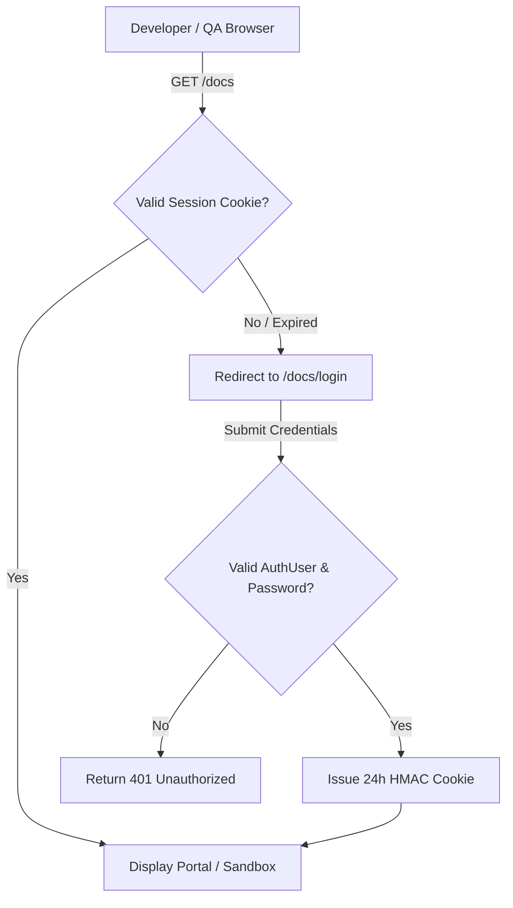
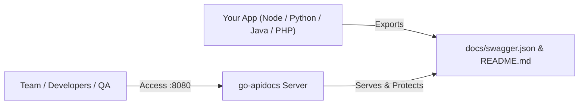

<div align="center">

# 📚 go-apidocs

### The All-In-One Swagger UI, Security Gate & Real-Time QA Testing Portal for Go

[](https://pkg.go.dev/github.com/Natykufsky/go-apidocs)
[](https://goreportcard.com/report/github.com/Natykufsky/go-apidocs)
[](https://opensource.org/licenses/MIT)
[](https://github.com/Natykufsky/go-apidocs/pulls)
[](https://github.com/Natykufsky/go-apidocs/graphs/commit-activity)

<p align="center">
  <strong>Drop-in OpenAPI 3.0 Documentation • Password Access Gate • ReadMe-Style Developer Guide • Real-Time Endpoint Stats & README Reader • Team-Wide QA Checklist • Instant Markdown Audit Reports • Zero Deployment Dependencies</strong>
</p>

</div>

---

## 🌟 Why `go-apidocs`?

Standard Swagger UI solutions only display static API contracts. **`go-apidocs`** turns your API documentation into a complete **Developer Portal & QA Collaboration Hub**:

1. **🏠 Interactive Developer Hub (`/`)**: Automatically reads and renders your project's `README.md` with rich typography and calculates **real-time live endpoint statistics**, HTTP method breakdowns, and engine domain explorers.
2. **📖 ReadMe-Style Developer Guide (`/guide`)**: Interactive multi-column developer reference powered by Scalar with full support for hash anchors (e.g. `/guide#description/introduction`), search, and multi-language code snippets.
3. **⚡ Swagger UI Sandbox (`/docs`)**: Interactive API playground with "Try It Out", token persistence, live global search (Ctrl+K), and dynamic scope filtering.
4. **🔒 Password Security Gate (`/docs/login`)**: Protect staging, offline, and production API specs from unauthorized eyes with cryptographic HMAC-signed session cookies and zero external auth dependencies.
5. **🔤 Portal Font Size Manager**: Accessible font scaling (`90% Compact`, `100% Default`, `110% Medium`, `125% Large`) directly in the header with `localStorage` persistence.
6. **🧪 Interactive QA Endpoint Inspector**: Step through endpoints sequentially (`Previous` / `Next`), toggle verification results (`🟢 Passed`, `🟡 Needs Retest`, `🔴 Failed / Bug Found`), and record Markdown reproduction steps.
7. **💾 Real-Time Team Synchronization**: All QA statuses and comments automatically sync to the backend server (`/docs/qa/*`) so the entire engineering team sees the exact same test progress.
8. **📋 Automated Executive Audit Reports (`/docs/qa/report`)**: Generate live Markdown reports of all tested endpoints with bug notes ready to download or copy into GitHub Issues, Jira, or Slack.
9. **📊 Operations Health Dashboard (`/dashboard`)**: Live service metrics, connection statuses, and interactive diagnostic log console.
10. **📱 Unified Mobile-First Top Header**: Consistent, responsive top navigation bar across all views with mobile drawer support.
11. **📦 100% Self-Contained (`//go:embed`)**: All React UI assets, CSS, and JS files are compiled directly into your Go binary. Zero CDN downtime, zero missing file paths on Docker/Kubernetes/cPanel/Air-gapped offline networks.

---

## ⚡ Quick Start: Is that all to run docs on any project?

**Yes! Literally 2 steps and 3 lines of code on any router:**

### 1. Install the package
```bash
go get github.com/Natykufsky/go-apidocs
```

### 2. Mount it on your favorite router

#### 🚀 Chi Router (`cmd/api/main.go` / `chi`)
```go
package main

import (
	"net/http"

	"github.com/go-chi/chi/v5"
	"github.com/go-chi/chi/v5/middleware"
	"github.com/Natykufsky/go-apidocs"
	chiadapter "github.com/Natykufsky/go-apidocs/chi"
)

func main() {
	r := chi.NewRouter()
	r.Use(middleware.Logger)
	r.Use(middleware.Recoverer)

	// 🚀 Register all docs, auth gate, QA tracking & portals on Chi router
	chiadapter.Mount(r, apidocs.Config{
		SpecFilePath: "./docs/swagger.json",
		Title:        "HarvestPad Platform API",
		AuthUser:     "admin",
		AuthPassword: "SecretPassword",
	})

	r.Get("/api/v1/health", func(w http.ResponseWriter, r *http.Request) {
		w.Write([]byte(`{"status":"ok"}`))
	})

	http.ListenAndServe(":8080", r)
}
```

#### 🚀 Gin Router (`cmd/api/main.go` / `gin`)
```go
package main

import (
	"github.com/gin-gonic/gin"
	"github.com/Natykufsky/go-apidocs"
	ginadapter "github.com/Natykufsky/go-apidocs/gin"
)

func main() {
	r := gin.Default()

	// 🚀 Register all docs, auth gate, QA tracking & portals on Gin router
	ginadapter.Mount(r, apidocs.Config{
		SpecFilePath: "./docs/swagger.json",
		Title:        "HarvestPad Platform API",
		AuthUser:     "admin",
		AuthPassword: "SecretPassword",
	})

	r.GET("/api/v1/health", func(c *gin.Context) {
		c.JSON(200, gin.H{"status": "ok"})
	})

	r.Run(":8080")
}
```

#### 🚀 Fiber Router (`cmd/api/main.go` / `fiber`)
```go
package main

import (
	"github.com/gofiber/fiber/v2"
	"github.com/Natykufsky/go-apidocs"
)

func main() {
	app := fiber.New()

	// 🚀 Mount the entire docs, security gate, QA tracker & portals on Fiber
	apidocs.Mount(app, apidocs.Config{
		SpecFilePath: "./docs/swagger.json",
		Title:        "HarvestPad Platform API",
		AuthUser:     "admin",
		AuthPassword: "SecretPassword",
	})

	app.Get("/api/v1/health", func(c *fiber.Ctx) error {
		return c.JSON(fiber.Map{"status": "ok"})
	})

	app.Listen(":8080")
}
```

Now open **`http://localhost:8080/docs`** (or **`http://localhost:8080/`**) in your browser! 🎉

---

## 📥 How Developers Can Import Their OpenAPI Spec

`go-apidocs` gives developers **3 flexible ways** to import their OpenAPI specs:

### Option 1: Single Monolithic `swagger.json` / `openapi.json`
Point `SpecFilePath` directly to your generated OpenAPI file (from tools like `swag`, `oapi-codegen`, `go-swagger`, or Postman exports):

```go
apidocs.Mount(app, apidocs.Config{
    SpecFilePath: "./docs/swagger.json", // or "./api/openapi.json"
    Title:        "My API Documentation",
})
```

### Option 2: Modular Multi-File Schema Structure (Zero Merge Conflicts)
As APIs scale, monolithic files cause Git merge conflicts. You can split your spec into modular files:
- `docs/swagger_base.json` (OpenAPI version, server URLs, security schemes)
- `docs/schemas.json` (Reusable DTO models)
- `docs/paths/*.json` (One JSON file per domain / controller, e.g. `auth.json`, `orders.json`)

```go
apidocs.Mount(app, apidocs.Config{
    DocsDir:  "./docs",       // Contains swagger_base.json and schemas.json
    PathsDir: "./docs/paths", // Auto-merges all JSON path files
})
```
`go-apidocs` automatically merges all schemas and paths in memory without requiring manual build scripts!

### Option 3: In-Browser Live Drag & Drop / File Upload (📥 Import Spec)
Developers and QA testers can import any local `swagger.json` or `openapi.json` file directly into the sandbox UI:
1. Open the sandbox at **`/docs`**.
2. Click the **📥 Import Spec** button in the top toolbar.
3. Select your local `.json` or `.yaml` file. The Swagger explorer and real-time QA testing suite will immediately render the imported endpoints in memory without restarting the backend!

### Option 4: Embedded Binary Distribution (`//go:embed`)
For standalone or offline binaries where no external files exist on disk, embed your spec directly in Go:

```go
//go:embed docs/*
var embeddedDocs embed.FS

apidocs.Mount(app, apidocs.Config{
    EmbeddedFS:   &embeddedDocs,
    SpecFilePath: "docs/swagger.json",
})
```

---

## 📦 Standalone Binary Releases (No Go Environment Required)

If you or your team use Node.js, Python, Java, PHP, or C# and don't have Go installed, you can download the precompiled single binary directly from GitHub Releases:

1. Go to **[GitHub Releases](https://github.com/Natykufsky/go-apidocs/releases)**.
2. Download the binary for your platform (`go-apidocs-linux-amd64`, `go-apidocs-darwin-arm64`, or `go-apidocs-windows-amd64.exe`).
3. Run it pointing to your OpenAPI file:
   ```bash
   ./go-apidocs --spec=./docs/swagger.json --readme=./README.md --port=8080
   ```
   Or install via `go install`:
   ```bash
   go install github.com/Natykufsky/go-apidocs/cmd/go-apidocs@latest
   ```

---

## 🔐 Managing Passwords & Security for Offline & Enterprise Usage

`go-apidocs` includes a zero-dependency **Authentication Gate** designed for air-gapped environments, offline local networks, staging environments, and internal enterprise systems:



### 1. Environment Variable Configuration (Recommended for Docker/K8s/CI)
No hardcoded passwords in source code. `go-apidocs` automatically reads standard environment variables:

```bash
export DOCS_AUTH_USER="developer"
export DOCS_AUTH_PASS="SuperSecretPassword123!"
export JWT_SECRET="cryptographic_signing_key_32_chars"
export DOCS_AUTH_ENABLED="true"
```

```go
// Reads directly from environment variables when fields are left blank
apidocs.Mount(app, apidocs.Config{
    Title: "Air-Gapped Core API",
})
```

### 2. Code-Level Configuration
```go
apidocs.Mount(app, apidocs.Config{
    AuthUser:     "staging_tester",
    AuthPassword: "StrongPassword2026#",
    JWTSecret:    "custom_hmac_secret_key",
})
```

### 3. Offline / Air-Gapped Operation
- **Zero Internet Requirement**: All assets (Vite React bundle, Swagger UI, Scalar engine, Lucide icons, and Tailwind styles) are embedded (`//go:embed`).
- **No External OAuth / Auth0 Needed**: The built-in HMAC token system authenticates offline users on private VPCs and on-premise servers.
- **Session Expiry & Invalidation**: Sessions expire after 24 hours or immediately when clicking the **Lock Session** (`/docs/logout`) button in the navbar.

---

## 🛠️ Configuration Reference

```go
cfg := apidocs.Config{
    // Base directory for documentation assets and OpenAPI schema files (default: "./docs")
    DocsDir: "./docs",

    // Optional modular directory containing endpoint json files (default: "<DocsDir>/paths")
    PathsDir: "./docs/paths",

    // Path to your project README markdown file (default: "<DocsDir>/README.md" or "./README.md")
    ReadmePath: "./README.md",

    // Path to your monolithic swagger.json (default: "<DocsDir>/swagger.json")
    SpecFilePath: "./docs/swagger.json",

    // Title displayed on Swagger UI and QA Audit reports
    Title: "My REST API Documentation",

    // Subtitle displayed in header brand
    Subtitle: "Developer Portal & QA Hub",

    // Brand emoji or icon
    BrandIcon: "⚡",

    // Unified Mobile-First Header Navigation (configurable in Go or loaded via /docs/nav JSON API)
    NavItems: []apidocs.NavItem{
        {Label: "Home", URL: "/", Icon: "🏠"},
        {Label: "Guide", URL: "/guide", Icon: "📖"},
        {Label: "API Sandbox", URL: "/docs", Icon: "⚡"},
        {Label: "Health", URL: "/dashboard", Icon: "📊"},
        {Label: "OpenAPI Spec", URL: "/docs/swagger.json", Icon: "📄", IsButton: true},
    },

    // Username for docs login (auto-reads from DOCS_AUTH_USER if empty)
    AuthUser: "developer",

    // Password for docs login (auto-reads from DOCS_AUTH_PASS if empty)
    AuthPassword: "MySuperSecurePassword!",

    // Secret key for HMAC cookie signatures (auto-reads from JWT_SECRET if empty)
    JWTSecret: "super_secret_session_signing_key",

    // Path where server-side QA test notes & comments are saved (default: "./docs/qa_tracker.json")
    QAStoragePath: "./docs/qa_tracker.json",

    // Optional: Map custom shorthand query modules (?module=auth) to OpenAPI tag names
    ModuleTagMap: map[string][]string{
        "auth":  {"01. Authentication & Identity"},
        "users": {"02. User Management"},
    },
}

// Mount on Chi
apidocs.MountChi(chiRouter, cfg)

// Mount on Gin
apidocs.MountGin(ginRouter, cfg)

// Mount on Fiber
apidocs.Mount(fiberApp, cfg)

// Mount on standard net/http ServeMux
apidocs.MountNetHTTP(mux, cfg)
```

---

## 📡 Built-In Endpoints

| Endpoint | Method | Description |
| :--- | :--- | :--- |
| **`/`** | `GET` | Developer Landing Hub with README.md markdown reader and live endpoint statistics. |
| **`/guide`** | `GET` | ReadMe-style interactive Developer Reference powered by Scalar (supports deep links like `#description/introduction`). |
| **`/docs`** | `GET` | Interactive Swagger UI Sandbox with QA checklist overlay, scope filters, and global search. |
| **`/docs/nav`** | `GET` | JSON endpoint delivering unified navigation links, brand titles, and menu structure. |
| **`/docs/readme`** | `GET` | Returns the raw project `README.md` markdown content. |
| **`/docs/login`** | `GET/POST` | Password login gate with HMAC session cookie authentication. |
| **`/docs/logout`** | `GET` | Invalidates docs session cookie and redirects to login. |
| **`/docs/swagger.json`** | `GET` | Dynamic OpenAPI JSON spec (supports `?module=...` and `?tag=...`). |
| **`/docs/qa/data`** | `GET` | Returns all recorded QA test statuses and comments across the team. |
| **`/docs/qa/record`** | `POST` | Upserts a test status (`passed`, `failed`, `retest`, `untested`) and comment. |
| **`/docs/qa/report`** | `GET` | Live formatted Markdown QA report table (`?format=json` supported). |
| **`/docs/qa/reset`** | `POST` | Clears all QA test data on the server to start a fresh sprint. |
| **`/dashboard`** | `GET` | System health and API status overview dashboard. |

---

## 🧪 Interactive QA Testing Flow & Modals

The built-in QA Suite allows engineering and QA teams to review APIs collaboratively:

1. **In-Line Status Badges & Comments**: Enable **QA Mode** in the sandbox header to interact directly with endpoints.
2. **Dedicated QA Sprint Report Modal**: Click **QA Report** to view testing completion metrics, filter endpoints by status, and search test comments.
3. **📊 1-Click Excel (.csv) & Markdown Audit Reports**:
   - **Export to Excel (`.csv`)**: One-click download formatted with UTF-8 BOM and RFC 4180 escaping for instant spreadsheet opening in Microsoft Excel or Google Sheets.
   - **Download Markdown (`.md`)**: Formatted Markdown audit table ready to paste into GitHub Issues, PRs, or Jira.
   - **REST API Automation**: Download reports programmatically via `GET /docs/qa/report?format=csv` or `GET /docs/qa/report?format=excel`.
4. **Endpoint Inspector Modal**: Click **Inspect** to review endpoint details, toggle statuses (`Passed`, `Needs Retest`, `Failed / Bug Found`, `Untested`), document bug reproduction steps, and navigate sequentially across endpoints using **Previous** / **Next** controls.

---

## 👥 Using `go-apidocs` in Any Stack (Node.js, Python, Java, PHP, Rust)

You don't need to be a Go developer to use `go-apidocs`. Run it as a **standalone documentation microservice / container sidecar** for your backend:



### Option A: Standalone Docker Container
```bash
docker run -d \
  -p 8080:8080 \
  -v $(pwd)/docs:/docs \
  -v $(pwd)/README.md:/docs/README.md \
  -e DOCS_AUTH_USER="admin" \
  -e DOCS_AUTH_PASS="SuperSecretPassword" \
  natykufsky/go-apidocs:latest
```

### Option B: Standalone Precompiled Binary
Download the precompiled single binary release and run:
```bash
./go-apidocs --spec=./docs/swagger.json --readme=./README.md --port=8080
```

---

## 📁 Recommended Project Layout & Modular OpenAPI Paths

To keep your backend codebase organized and maintainable as your API grows to hundreds of endpoints, we recommend structuring your documentation folder like this:

```text
your-project/
├── cmd/api/main.go
├── README.md                 # Project README (automatically rendered on /)
├── docs/
│   ├── swagger.json          # Master generated/merged OpenAPI 3.0 specification
│   ├── schemas.json          # Reusable shared DTO/model definitions
│   ├── qa_tracker.json       # Auto-created by go-apidocs for QA notes
│   └── paths/                # (Optional & Recommended) Modular endpoint definitions
│       ├── auth.json         # Authentication & Identity routes
│       ├── users.json        # User profile & management routes
│       ├── billing.json      # Invoices & wallet payment routes
│       └── messaging.json    # Core business API routes
```

### 💡 Why Split into `docs/paths/*.json`?
1. **Zero Merge Conflicts**: When multiple developers or teams add new endpoints in the same sprint, they edit separate files under `paths/` instead of conflicting on a 10,000-line `swagger.json`.
2. **Modular Tag Mapping**: Easily map `paths/` domains to shorthand query filters in `apidocs.Mount()` (e.g. `?module=billing` or `?tag=Messaging`).
3. **Automated Merging**: `go-apidocs` automatically resolves and merges modular schemas and paths during runtime filtering!

---

## 🤝 Collaboration & Contributor Roadmap

We believe API documentation shouldn't just be static HTML—it should be a **collaborative workspace** connecting backend engineers, frontend developers, QA testers, and product managers.

Whether you want to contribute in **Go**, **TypeScript / React**, **UI/UX Design**, or **Documentation**, here is where we're headed and where we need your help:

### 🗺️ High-Impact Contribution Areas:

#### 1. 🌐 Multi-Router Ecosystem Adapters
Expand framework coverage beyond Fiber, Chi, and Gin:
- [x] **Gin Adapter** (`github.com/Natykufsky/go-apidocs/gin` & `apidocs.MountGin(r, cfg)`)
- [x] **Chi / net/http Adapter** (`github.com/Natykufsky/go-apidocs/chi` & `apidocs.MountChi(r, cfg)`)
- [ ] **Echo Adapter** (`github.com/Natykufsky/go-apidocs/echo` -> `apidocs.MountEcho(e, cfg)`)

#### 2. 💾 Multi-Tenant QA Persistence Backends
Enable distributed teams to sync test results without relying only on local JSON:
- [ ] **PostgreSQL / MySQL Driver** (stores QA test runs directly in your database via `gorm` or `sqlx`)
- [ ] **SQLite Embedded Driver** (lightweight zero-config persistence for local containers)
- [ ] **Redis Streams Driver** (pub/sub live test notifications across the engineering team)

#### 3. 🎨 Next-Gen React UI (`/ui`)
Extend the React 18 + TypeScript + Tailwind portal with rich tooling:
- [x] **Scalar Developer Guide Reference** with deep linking (`/guide#description/introduction`)
- [x] **Real-time Live Endpoint Statistics** & HTTP method distribution
- [x] **Integrated README.md Markdown Reader** on Landing portal
- [x] **Unified Mobile-First Navigation Header with Font Size Manager**
- [x] **Interactive QA Endpoint Inspector & Sprint Report Modals**
- [ ] **Interactive Webhook Simulator** (trigger test delivery payloads and inspect HMAC signatures in real time)
- [ ] **Mock Server Simulator** (generate instant mock JSON responses directly in browser without a live backend)
- [ ] **1-Click Postman & Insomnia Collection Exporter**

#### 4. 📢 Team Notifications & CI/CD Integrations
- [ ] **Slack & Discord Webhook Alerts** (automatically notify your dev channel when QA marks an endpoint as `🔴 FAILED / BUG`)
- [ ] **GitHub Actions / GitLab CI Runner** (fail automated builds if untested or broken endpoints exist)

---

### 🎨 Frontend React UI Development (`/ui`):
The UI is built with **React 18 + Vite + TypeScript + Tailwind CSS**:
```bash
cd ui
npm install
npm run dev    # Starts hot-reloading dev server on http://localhost:3000
npm run build  # Compiles production bundle directly into ../assets/dist/
```

### 🛠️ Step-by-Step Contribution Workflow:
1. **Fork the Repository**: Click the `Fork` button on [GitHub](https://github.com/Natykufsky/go-apidocs).
2. **Clone your fork**:
   ```bash
   git clone https://github.com/YOUR_USERNAME/go-apidocs.git
   cd go-apidocs
   ```
3. **Create a Feature Branch**:
   ```bash
   git checkout -b feat/my-new-feature
   ```
4. **Commit & Push**:
   ```bash
   git commit -m "feat: describe your change"
   git push origin feat/my-new-feature
   ```
5. **Open a Pull Request**: Submit your PR with a clear description and tests. We review and merge active PRs quickly!

---

## 🙏 Acknowledgements & Third-Party Credits

`go-apidocs` is built on top of incredible open-source tools, libraries, and frameworks. Huge thanks to their authors and maintainers:

- **[Swagger UI](https://swagger.io/tools/swagger-ui/)** (`swagger-ui-react`): The industry standard interactive OpenAPI API exploration and testing sandbox.
- **[Scalar](https://scalar.com)** (`@scalar/api-reference-react`): Beautiful, modern, multi-column interactive API reference and documentation renderer.
- **[Fiber](https://gofiber.io/)**: Express-inspired, ultra-fast web framework built on top of Fasthttp.
- **[Chi](https://github.com/go-chi/chi)**: Lightweight, idiomatic, and composable router for Go HTTP services.
- **[Gin](https://gin-gonic.com/)**: Fast HTTP web framework with martini-like API for Go.
- **[React 18](https://react.dev/) & [Vite](https://vitejs.dev/)**: Next-generation frontend framework and lightning-fast build tooling.
- **[Tailwind CSS](https://tailwindcss.com/)**: Utility-first CSS framework for clean, responsive UI styling.
- **[Lucide Icons](https://lucide.dev/)**: Crisp, consistent, and beautiful icon set for modern web applications.
- **[marked](https://marked.js.org/)**: Fast, lightweight markdown parser and compiler for project `README.md` rendering.

---

## 💬 Community, Support & Author

- 👨‍💻 **Author & Maintainer**: **[Eng. Kufre N. Moses (Natykufsky)](https://github.com/Natykufsky)**
- 📧 **Direct Inquiries & Support**: [natykufsky@gmail.com](mailto:natykufsky@gmail.com)
- 🐛 **Found a bug or have an idea?** [Open a GitHub Issue](https://github.com/Natykufsky/go-apidocs/issues)
- ⭐ **Star the Repo**: If you find `go-apidocs` helpful, please give it a star on [GitHub](https://github.com/Natykufsky/go-apidocs)!

---

## 📄 License

This project is open-source and licensed under the [MIT License](LICENSE).

Copyright (c) 2026 **[Eng. Kufre N. Moses (Natykufsky)](https://github.com/Natykufsky)**.
